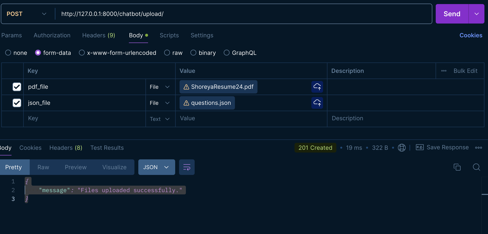
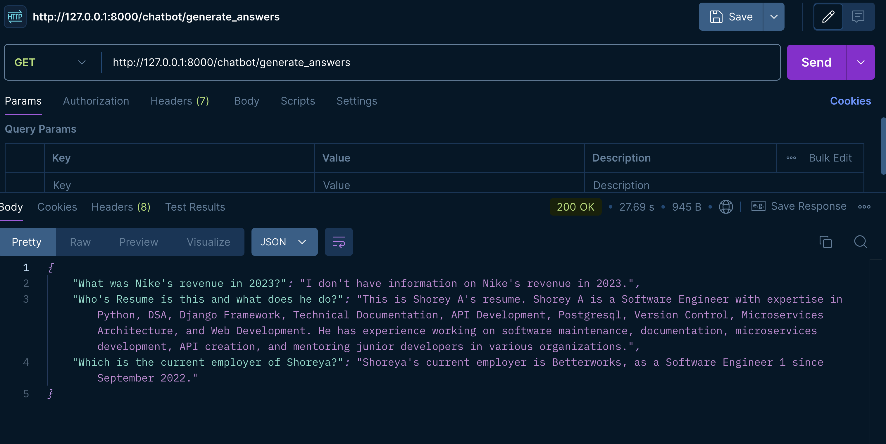

# Django Project

## Overview

This Django project includes two POST APIs designed for 

1. Uploading PDF File (Basically content) and Uploading Json File (list of questions)

2. Generate Answers for all those questions from that provided content file,

Below is a guide to set up the project, run the server, and interact with the APIs.

## Setup and Installation

### Prerequisites

- Python 3.12

### Step 1: Create a Virtual Environment

Create a virtual environment for the project to manage dependencies:

```bash
python3.12 -m venv venv 
```

### Step 2: Activate the Virtual Environment

- On Windows: ```venv\Scripts\activate```

- On macOS and Linux: ```source venv/bin/activate```

### Step 3: Install Dependencies
Install the required libraries listed in requirements.txt:

- pip install -r requirements.txt

###  Step 4: Run the Django Server
- ```python manage.py migrate```
- ```python manage.py runserver```

    The server will be available at http://127.0.0.1:8000/.

## API Endpoints

1. POST `/chatbot/upload/`

- Purpose
    This endpoint will upload the PDF file and JSON file which will be used for Question and Answering.
        - PDF can be any valid pdf file with any name
        - Json file should be list of questions

- Request
    Method: POST

    Body: form-data
            {
    "pdf_file": "value1",
    "json_file": "value2"
    }

    Example curl Command: 
    ```
        curl --location 'http://127.0.0.1:8000/chatbot/upload/' \
        --form 'pdf_file=@"/Users/shoreyagupta/Downloads/ShoreyaResume24.pdf"' \
        --form 'json_file=@"/Users/shoreyagupta/Downloads/questions.json"'
    ```

    Response:
        Status Code: 201 OK
        Content: {
        "message": "Files uploaded successfully."
        }
    
    - Response Showcase
    


2. POST `/chatbot/generate_answers`

- Purpose
    This Endpoint will fetch a JSON formatted Answers for each question which were provided in JSON file


- Request
    Method: GET


    Example curl Command: 
    ```
        curl --location 'http://127.0.0.1:8000/chatbot/generate_answers'
    ```

    Response:
        Status Code: 200 Success
        {
            "What was Nike's revenue in 2023?": "I don't know the specific revenue figure for Nike in 2023 based on the provided context.",
            "What's the mobile number of Shoreya?": "Shoreya's mobile number is 9716723882.",
            "What's the Highest Degree of Shoreya?": "The provided information does not specify the highest degree of Shoreya.",
            "Will Shoreya be a good fit for Senior Software Engineering Role?": "Shoreya might be a good fit for a Senior Software Engineering role based on the skills and experience highlighted, such as Python, Django Framework, API development, and technical documentation. They have demonstrated success in troubleshooting and resolving complex software challenges, which are valuable traits for a senior position. However, without specific senior-level experience mentioned, further assessment would be needed to determine the suitability for that role."
    }
    
    - Response Showcase

    
